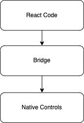
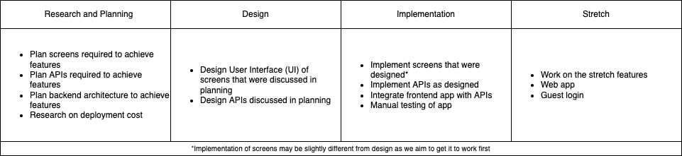
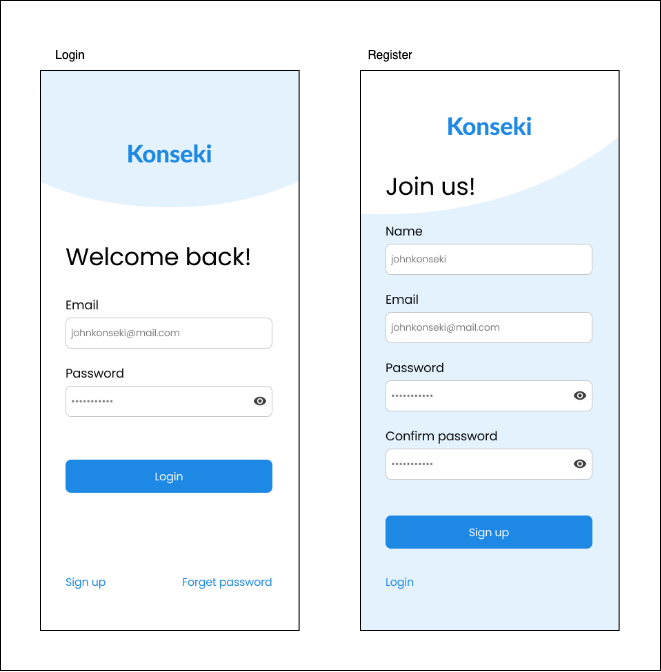
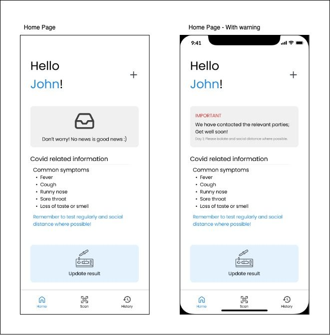
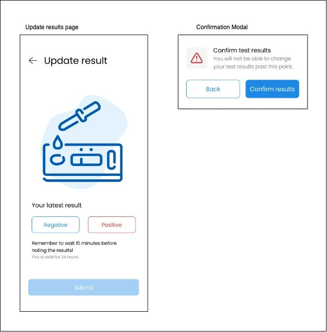
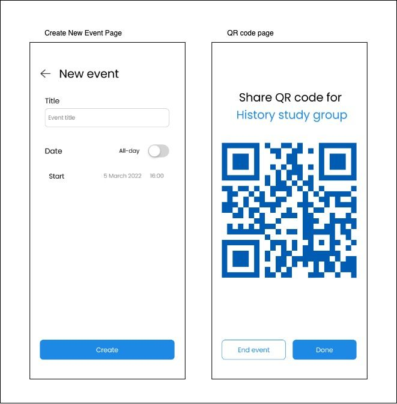
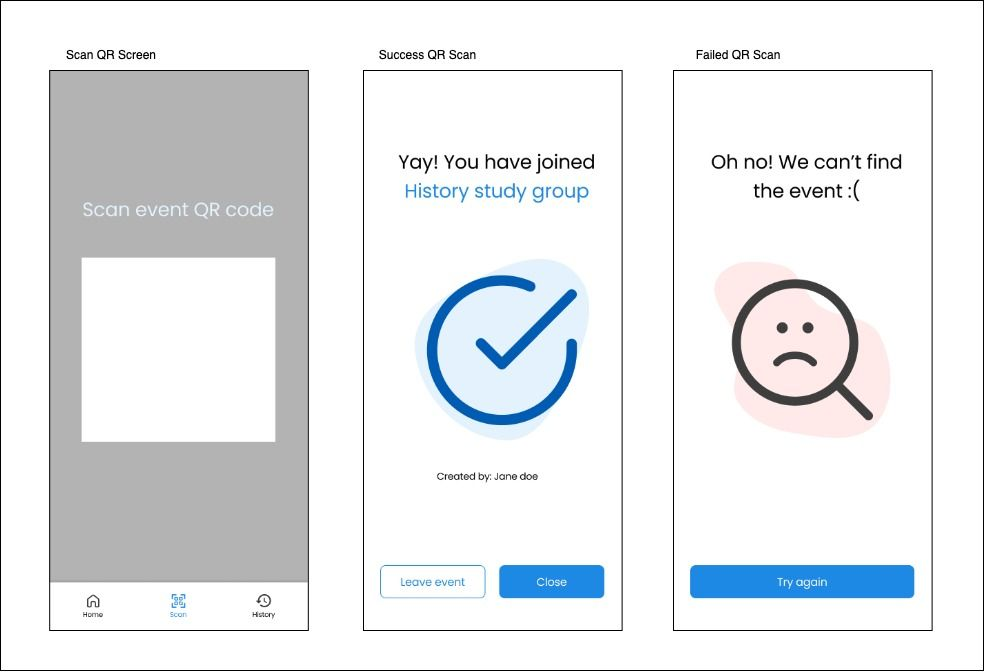
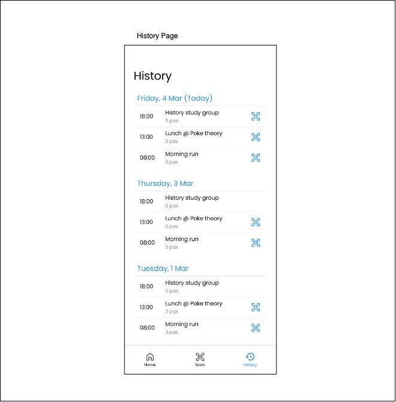
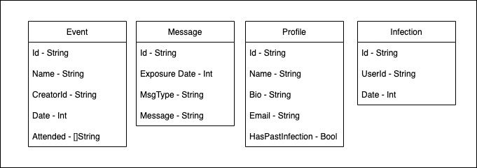

Hello World.

A while back, my friend and I made our first mobile application. The goal to the app was simple.

> Keep track of who you met on which day so you can notify them if you got infected with a virus

## Motivation

At the time of building the application, we have a pandemic on going in Singapore. We believe that if you are infected, you have a social responsibility to inform the people that you have met recently so they can monitor and prevent the spread. Though many have long forgotten about Covid-19, there are still some who are wary and would want to avoid the spread of it. Hence I came up with the following feature sets for the application.

## Features

1. Users can create events with QR codes where people can join. This logs who they met on what day

2. Users can update their virus status

3. Notification sent to users that met infected user in the past 7 days

4. Information on the next course of action will be shown when notified

## Questions

After coming up with the features, there are some questions that need to be answered before we start building.

### 1. Can this be achieved with what we have today?

There is this scene in a show called Silicon Valley where a guy pitches to Richard Hendricks (the main character) about an app that helps you remember where you parked your car. After hearing the pitch, Richard pointed out that people could just use the Notes app in their phone to achieve the same goal.

[Link to video](https://youtu.be/ZRNEUc5k7Jw)

So we tried to come up with some ideas on whether it is possible to achieve the same goals with current tools. Here is what we came up with:

| Solution                                                                                         | Issues                                                                                                                                                                              |
| ------------------------------------------------------------------------------------------------ | ----------------------------------------------------------------------------------------------------------------------------------------------------------------------------------- |
| Set up a chat group for every day you go out. Add people you have met with that day to the group | Troublesome. Have to set up so many groups and update individual groups everytime. No privacy. Everyone you met that day will know who else you met thay day as well.               |
| Write down who you met in notes and update them individually when you are infected               | Inconvenient. Imagine if you met 20 people in the past 7 days. You will need to message 20 people. Uni-directional. You keep track of them but they may not have kept track of you. |

With the solutions provided above looking inconvenient, there are no convenient ways to achieve this goal.

### 2. Does it really need to be a mobile application?

Mobile applications are known to be tough to build and maintain. You have to care about the Apple's terms of service, Google's terms of service, the changing hardware specifications of different phones etc. Is it possible to just have a web application that runs off the browser instead?

The main up side of having a mobile application is that we can leverage on the pop up notification service. When any of your close contacts get infected, you would want to receive a pop up notification on your phone instantly to be notified. If we were to build a web app instead, we can only rely on email notifications to notify the users or hope that they check the app frequently.

\*\*NOTE: We can also use SMS notifications. But I do not have the budget to do that.

### 3. Does the features meet the needs of the users?

We conducted a small and short survey to find this out if this meets a real need. Out of the 10 people asked, 7 of them said they do not care about the pandemic at all. It is good to note that all 8 of the 10 have already contracted Covid-19.

Out of the 3 people who cared, 1 said "getting covid is a sooner or later thing. You should stop wasting your time and start studying for finals". The other 2 responded positively saying they would use it and gave some improvements to consider.

So... We are gonna build it for you 2 :)

## Additional Feature

After answering those questions and getting some feedback, we made some additions to the features we want to build. We assumed that everyone will download the app and use it. However, what if you are going out with your friends and all your friends do not have the app? They will have to stand there and wait for the app to download making a it bad user experience. Or worse, they might just not use the app as it is a hassle. Thus the following are the additional features proposed:

1. Web application version of the app for those that do not have the mobile application

2. Email notifications - this is mainly for those that choose not to download the app. It also serves as an additional layer of notification for those who have the app.

3. Guest login - Allow users to just quickly enter their email and log into the event as guest. They can retrieve their usage when they sign up with the same email.

With the features well thought out (kinda), we now need to pick the tools we want to use to build our app.

## Technical Stack

For the tech stack, certain considerations were taken into account before making a choice. As this was a small personal project, we chose to move out of what we are comfortable with and tried different technologies that we have not used before.

With limited manpower, we needed something cross-platform with one codebase. This limited us to 2 choices. Flutter and React Native. The key difference between the 2 (other than the language) was mainly how they render the screens. Flutter controls every pixel on the screen while React Native has a layer of abstraction on top of the platform's native controls.



As such, we will go with Flutter to give us more control over what we can do on screen.

We would preferably use AngularJs for our web version of the application. Flutter does seem to support web applications as well. However, since the web version of the app may have a different view, it would be beneficial to have a different code base. Besides, we would want to push them to download the app rather than use the web version.

For the backend systems, we will use the Go programming language with the gin library to do the web-related APIs. Go was chosen for a few reasons. Firstly, it is strongly typed making it easy to scale if the application gets bigger. Next, it supports concurrency which may be useful in our application. Lastly, Go is a very up-and-coming language with many companies starting to adopt it due to its performance.

Instead of managing authentication by ourselves, we decided to go with **Firebase** authentication. It is free (unless the app blows up in popularity), simple to use, and has good documentation. **Firebase** will also be our choice of database. Simply put, **Firebase** is a one-stop shop. It provides notification services as well for mobile applications.

To summarise, we will be using the **Flutter** and **AngularJs** framework to code our user-facing application. **Go** and **Firebase** is used on the backend to manage data and user actions. (Can you see something common?)

\*\*NOTE: The stack chosen does has its drawbacks. We will discuss this in a later section

## Timeline

For this project, we split the timeline up into 4 phases. Research and planning, Design, Implementation and Stretch.



Above shows the general project plan. For those project managers reading this, please give chance. I do have a kanban board but it is a little bit messy.

We target to finish this project between 2 weeks and 1 month depending on the free time we have from school.

As seen in the image above, the general idea is to plan, design and implement. The stretch phase is only after we have launched the Minimum Viable Product (MVP).

## App UI Plan and Design

The general layout of the app should be simple and easy to use. We split the app into 4 key screens:

1. Authentication screen

2. Home screen

3. Scan screen

4. History screen

### Authentication Screen

As the name suggests, it is the screen where you do all authentication related actions. User MUST be logged in to use the app. This screen lets users login if they already have an account or register if they do not.



We try to minimise the amount of information required to register to reduce the hassle brought to the user. Hence every field we need is required for a reason. We require name, email and password to register. Name is so other users are able to know who actually joined their event. Email and password is for authentication. A confirm password field is also added to reduce the chance to the user mistyping the password. This field is slowly disappearing in the newer apps today but we feel that this is important.

### Home Screen

The home screen contains most of the functionality of the app. It is also the first page the user sees when they open the app or first login. The home section is where the users can create events and update their infection status. The page will also show key information about the virus, potential close contacts as well as any other relevant information that would help the user.







### Scan Screen

This section only has 1 functionality and is to **Scan QR codes** of events created by other users. It will look out for valid event QR codes and scan it to allow the users to join the events.



### History Screen

**Shows history** of the events the user has joined. Also allows users to **access event QR codes**h to allow other users to join the event.



## Design Philosophy

```txt
Make it work. Refactor later.
```

Not something anyone likes to hear. But well...

We prioritise making sure the key functionalities work before everything else. Hence, much to our designer's unhappiness, some of her designs did not appear on the app. However we do strive to follow the user interface as much as possible. What we mean by "designs not appearing" are minute things like fonts and colours not matching the design.

## Frontend

Flutter uses the concept of screens and widgets. Screens are the different (well) screens the users see. The widgets are the different things that appear on the screen.

For example, the text that appears on the screen is a widget. Any text form, button, headers are all widgets. Using that concept, we can split our application into different parts and code out those specific widgets. This will reduce code repetition. This does present some challenges as the widgets need to be flexible and easily extendible. On top of that, flutter does provide a library of widgets that we can freely use as well.

Since we do not really know which part is commonly repeated, we adopted a "lazy" approach. If we see that certain widgets are similar with only certain styling changes, we abstract it out into another widget file.

In a bigger team, we would ideally have a design system where the app will use similar widgets across the application.

## Backend

The backend is broken down into 3 parts. Authentication, Backend Services and Storage.

### Authentication

For the backend authentication, we "outsourced" the work to Firebase Authentications. Even though we do know how to build an authentication system, it is usually highly discouraged. The simple reason being "you don't know what you don't know". A large number of things can go wrong if we are not careful. And if you are using open source libraries, it might also leave you vulnerable at times. Thus, for simplicity and focusing of building other features, we decided to use Firebase Authentications.

Authentication is achieved using tokens. Tokens are sent to the user after they are authenticated. The token contains information about the user that can be guaranteed to be correct. You can read more about this is a future article.

We also use Firebase for our database storage. This makes it convenient for us to validate the token the user provides with their request and for the backend server to retrieve user information from the token.

### Backend Services

The purpose of the backend server is to provide access to information for the application to run. We provide APIs to create users, create events, join events, etc. These will be done through HTTP requests and responses. It is worth noting here that even though we use external tools for authentication, creating users is still done using our services. External tools only take care of the authentication information. They should not be caring about user information like "Full name", "Profile Picture", etc.



- Create Events - POST - create a new event

- Get Event (singular) - GET - get individual events with more info

- Get Events - GET - get bulk events

- Get Message (singular) - GET - get a specific message with all the info

- Get Messages - GET - get the bulk of messages for the user

- Get Profile Info - GET - get user information (not regarding
  authentication)

- Join Event - POST - join an event

- Register - POST - resister user profiles and posting information

- Update Status - POST - updates user infection status


\
Since user has to be logged in to use the app, all routes are **protected** (with the exception of **Register**). This means that every protected request has to be sent with a token as well. If the token is invalid or not present, the app will not be able to retrieve the information.

Most of the routes provided are relatively self explanatory. Certain routes might need more explanation as they need to do some underlying logic when executed.



When the app sends a request to join an event, we retrieve the user's information from the token that is sent with the request. We further check that the user is valid before adding the user to the event.


\


When the user's infection status is updated, a couple of things happen behind the scenes. The server will first retrieve all events that the user has attended in the past 7 days. Afterwards, it will consolidate all the users in those events into a list. Messages will be created and stored for each user. Affected users will receive a notification though the app.



### Storage

As mentioned above, Firebase was used for storage. It uses a collection document style system. Unlike SQL, this form of database storage allows for a little more flexibility. Flexibility in the sense that we am not fixed to a certain schema right from the start. However, of course, there are draw backs to this. The flexibility means we have to validate the information we receive. Some fields may be empty, some might be of a different datatype, etc. We can manage this to a certain extent using structs in the Go programming language. This will cast all documents to the correct data type if possible.

We have a total of 4 collections.

1. Events

2. Profiles

3. Messages

4. Statuses



Within each collection contains documents with the fields shown in the above image.

## Testing

For testing of the frontend app, there are developer tools available to emulate mobile phones. However, as we need to test the camera functionality for QR code scanning, we used an iPhone 10 and a Samsung S20 (I think) which are both major platforms for their operating system to do further testing.

For testing of the backend services, we deployed the code to Heroku as it was free and kind of a one click wonder. However, it does have many limitations that are beyond the scope here. We test the routes using postman and individually test each route to make sure it achieves the correct behaviour. Furthermore, we use postman's automated API workflow to simulate user interactions with the API.

Lastly, we did some basic user testing. We did this by setting out a few tasks for our users and see if they could accomplish them without any assistance. We turned to the 2 people that responded positively in our previous survey for testing.



1. Create an event
2. Scan Event QR code
3. Update infection status


\
They were able to carry out the tasks with ease and find all relevant information they needed. However, we did note some performance issues of the app that may need some fixing.

\*\*NOTE: We did skip all the unit testing stuff.

## Deployment

For the most part, deploying the backend service of the application to production is rather simple.

### Backend Services

To keep in line with what we have been using (if you have not noticed by now, everything we used is built by Google), we went with Google Cloud Platforms (GCP). They provide $300 credit to help you start off. To deploy the database to production, we created a new project on Firebase (separate from testing) and retrieved a new private key file for the production backend service.

Here is where the simple ends. We need to deploy the application to the 2 major stores. Google Play Store and Apple App Store.

### Google Play Store

Firstly, google charges a one time fee of $25 for a google developer account. Then there is a review process that may take up to a week if you are a new developer. This process checks if your app is free of malware, does what it says it would do and a ton of other guidelines. The review can be rejected if you do not follow their guidelines. You will then have to fix it and request another review.

After which, if you pass, your app will appear on the google play store. However, since it is new, it probably won't be seen by anyone.

\*\*NOTE: It used to be $15 for a developer account and instant upload of your application. However, people started to use this as a way to inject malware on to phones. Thus Google started having review processes. We just can't have nice things.

### Apple App Store

To deploy your application onto the Apple App Store, you first need to have a developer account which costs $100/year. After that, you can upload your application and they will review it.

Apple is known to be very stringent on checking the apps that are on their app store. They really want their users to have a good experience using apps on their phone. Thus, they will reject the app for reasons like if it is buggy, have too much advertisements, too slow and many more.

If you cannot tell by now, we did not put our app on any of the app stores. The message by Apple and Google is clear. They only want serious apps on their app stores. At the time of finishing up the core features, Singapore is no longer concerned about Covid spread. Masks are no longer mandatory if you are in open areas. TraceTogether (Singapore's own tracing app) is also no longer being used. Thus, it does not seem worth it to pay $125 just to deploy 1 application that will not make any money.

## Learning Outcomes

Not every story ends with a happy ending. Though we had set ourselves the goal of seeing this though till posting the application on the the relevant app stores, we ended up not finishing the last part. However, we did learn a lot from this experience.

### 1. Developing a mobile application is tough

Unlike web applications, mobile applications take more time and effort to develop and test. One example of this was the feature to scan QR codes. Even though there are emulator tools provided on the developers computer, we are not able to point it at a QR code (that we know of). As such we have to consistently load it onto a phone to test out the feature which is very time consuming.

We also need to deal with the wide variety of phones that are present in the market. In this project, we only tested it on 2 phones. However, there are many different phones that may produce hidden bugs that we do not know about.

### 2. You depend on Apple and Google

We are at the mercy of what the owners of the 2 biggest app stores think is best for their users. If they feel you app is just not right or not good enough, months of work could go down the drain. On this part, I do empathise with those companies that have to deal with the whole "monopolistic" behaviour of these companies. Well... it is what it is. I'm not here to argue about this.

### 3. Be sure of what you want to build

Let's say you have the intention of actually deploying an application, but after a day or 2, you decided "Omg! I don't like that colour!" or "Oh no, there is a typo". It's not like you could just push the new code and the new version will be deployed. You have to go through the whole review process again. And on top of that, convince your users to update their apps to the new version! The last one is the tough part. People do not bother updating their apps unless you bring in new visible features. Do you keeps your phone up to date with the latest OS? I highly doubt so. That is why Apple is known to add new emojis to security updates to motivate people to update their OS. Similarly, users won't really care if there is "Bug fixes and Improvements" most of the times.

To conclude, though we did not reach the goal we had in mind, the lessons we learned along the way gave us greater appreciation into the amount of work that goes into building a mobile application.

Special thanks to [@huihui](https://www.linkedin.com/in/hui-hui-fang/) for helping me with the designs.

Discussions welcomed [here](https://discord.com/channels/983983773077098496/984012416247529492/984012753675100190).

## Code

[Frontend Code](https://github.com/fangpinsern/konseki-fe)

[Backend Code](https://github.com/fangpinsern/konseki-be)

## Additional Info

Some additional information to support above design decisions.

### Why shouldn't you build you own Authentication?

[Please everyone, stop writing your own user authentication code](https://withblue.ink/2020/04/08/stop-writing-your-own-user-authentication-code.html)

[Make one resolution this year. Never write your own Authentication](https://dev.to/jordanfinners/make-one-resolution-this-year-never-write-your-own-authentication-3nc1#why)

### Flutter VS React Native

[Flutter vs React Native: A Detailed Comparision](https://hackr.io/blog/react-native-vs-flutter)

### App Store Publishing

[How long does it typically take to publish an app on the Google Play Store?](https://www.quora.com/How-long-does-it-typically-take-to-publish-an-app-on-the-Google-Play-Store?share=1)

[How long does it take to get an app into the app store?](https://www.agicent.com/blog/how-long-does-it-take-to-get-an-app-into-the-app-store/)
