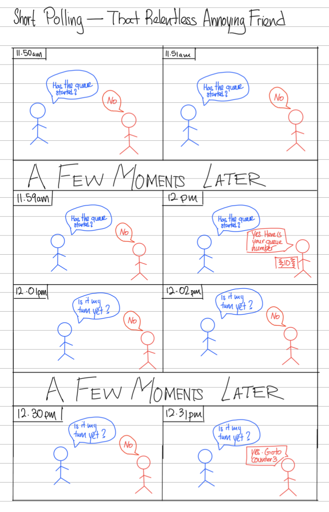
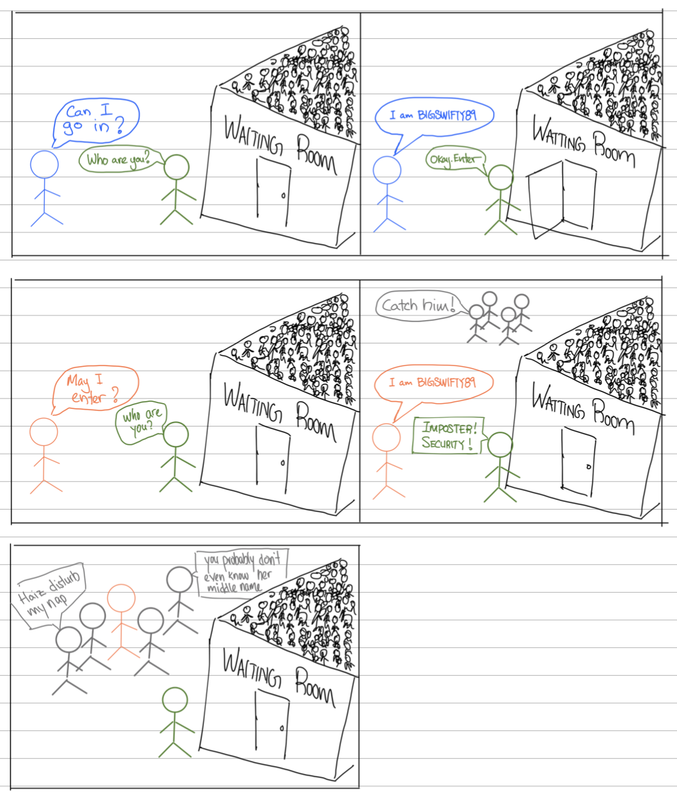
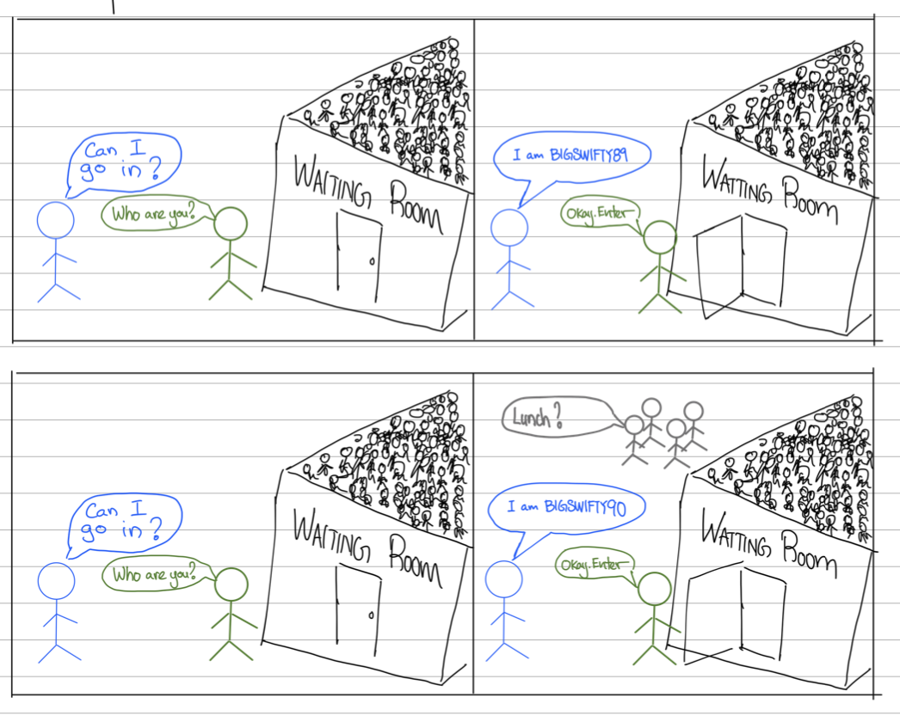
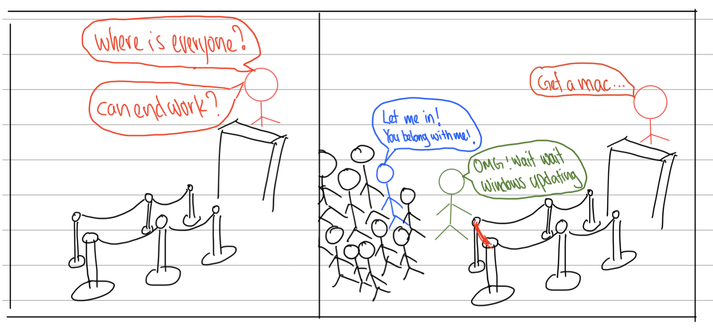
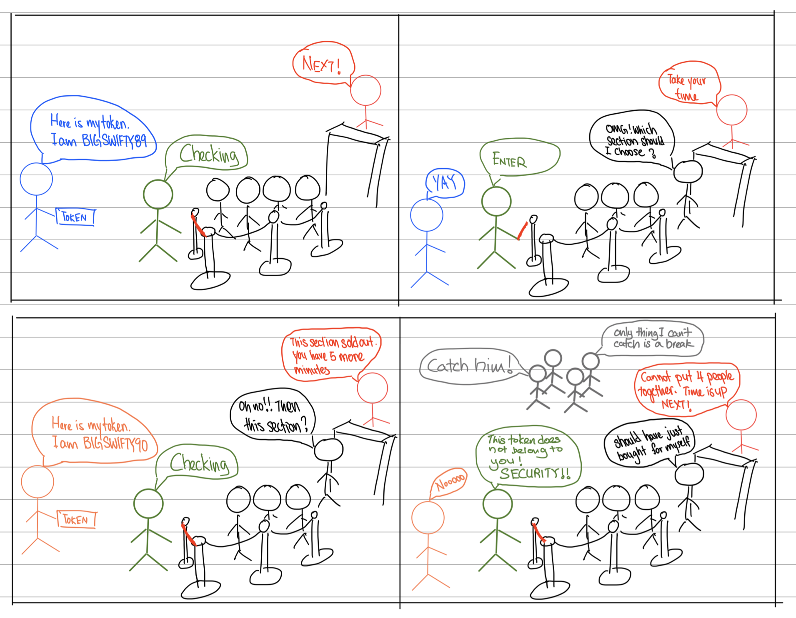
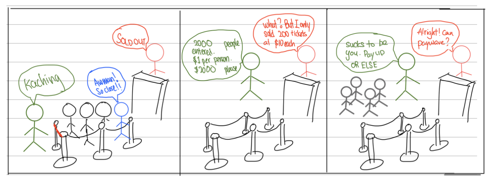

In the past few weeks, mega music star Taylor Swift started selling tickets to her concert in Singapore. As it is the only stop in South East Asia, her tickets were in high demand. People from all over the region are fighting for the tickets. News articles reported fans asking [40 friends and relatives to register for the general sale](https://www.todayonline.com/singapore/super-stressed-taylor-swift-fans-pull-out-all-stops-bid-secure-singapore-concert-tickets-2201956).

There were originally 3 nights available but after overwhelming registration numbers for the general sale, the organizers increased it to 6 nights. The sale of tickets was split into 2 days. One for pre-sale and one for general sale.

> Pre-sale - Only open to UOB card holders as UOB is the banking sponsor of the event.

> General Sale - Only open to those that got an access code in their email after an earlier pre-registration. Only some pre-registered users got the access codes while others are put on the waitlist.

## What happened

On the day of both the pre-sale and general sale, fans were faced with technical problems on the ticketing website Ticketmaster.

### Users unable to login

On the day of the pre-sale, people were unable to log in to their Ticketmaster accounts. Many saw the error message "rate exceeded". Fans found themselves selecting their seats but unable to check out as you can only purchase tickets if you are logged in. So even though they got an amazing queue number, they were not able to buy tickets. All they could do was sit there and watch their queue number slowly expire.

### Access code used by someone else

The login issue was resolved as users learned from pre-sale and logged in in advance. However, another issue arose during general sale day.

Some users reported that their access code was used by someone else. After they selected the seats, they see an error message that their token has exceeded the allowed number of tickets to be purchased.

## Possible Causes

I do not work at Ticketmaster. But as a curious software engineer, I tried to figure out what happened so I can buy MY TICKETS. Based on what I can see, here is what likely happened.

### Rate Exceeded Error

For the log-in issue that happened during pre-sale, a rate limit safeguard is likely being activated.

In all software systems (especially systems exposed to the public) there is usually a rate limit built into it. This prevents malicious users from breaking the system by overloading it with requests.

> Rate limit - upper bound of the number of times you can make a request to a server in a given time frame

You may think you are just making 1 request to log in. Why would the rate limit mechanism be activated on you?

From what I see, Ticketmaster does not do authentication itself. Instead, they use a third-party service ([AWS Cognito](https://docs.aws.amazon.com/cognito/latest/developerguide/limits.html)) to do authentication for them. Hence this "rate exceeded" error was not coming from Ticketmaster. It was coming directly from AWS. And AWS does not care who you as an individual are. They just see that their client (Ticketmaster) itself is making hundreds of thousands of requests a second and the rate limit mechanism was activated on Ticketmaster as a whole to protect AWS services.

It would take some time for them to make a request and increase the rate limit. However, by the time it took effect, it might have been too late. I do suspect they did not do anything actually and just let the issue resolve itself.

### Malicious use of access codes

The access code, though unique, is easily guessable. It is the country code followed by the phone number. What might have happened was someone just kept guessing different numbers and got in. Alternatively, it might be someone knowing that you got the access code and used it for themselves secretly.

For example, if you got the access code and posted it online to show the world, one of your followers that has your phone number can just use it and purchase it without you knowing as the access code is not tagged to your account or email.

## Defensive Buying

Knowing the likely causes, how can we prevent ourselves from facing these issues?

It is quite simple actually. Just log in ahead of time and don't go bragging online. No rocket science.

The million-dollar question is, after protecting yourself from all these issues, how can you get the best possible queue number?

## Process and System

Whether you are a scalper or a true fan, to improve your chances of getting the best queue number, we need to first understand the ticket-buying process as well as the system that is put in place to manage it.

### Ticket buying process

The whole process of purchasing a ticket on Ticketmaster for a major event from start to finish is as such. Let's say the queue opens at 12 pm. If you are there before 12 pm, you will be put into a waiting room. Once the queue opens at 12, everyone in the waiting room will be randomly assigned a queue number. And based on the queue number, you can enter and buy your tickets.

The whole process is trying to simulate the physical buying experience online. Once you get into the ticket purchasing site, you will have 10 minutes to choose the section you want to be seated in. You do not get to choose the seat itself. After you choose the section you want, the system will try to find seats that can fit all of the tickets together. If you wanted 4 tickets, the 4 seats have to be together. If the system cannot find 4 seats together, they will redirect you back to the selection page and ask you to choose again. The 10 minutes time limit does not reset.

You have to reach the payment page before the 10 minutes are up. If not you will lose your chance to buy the tickets. After you reach the payment page, you will then have another 10 minutes to pay. Once the payment passes through, congratulations on being the proud owner of these exclusive tickets.

### Reverse Engineering

As mentioned above, I do not work at Ticketmaster. So what I am saying below is all just a guess on how the ticket system is designed.

#### Wait room and queue numbers

Ticket master likely uses `short-polling` for their wait room and queue services. Short polling is when your browser calls the backend servers during a set time interval. Here is an illustration of how short polling works.

Due to this design, you may not be entering the queue at exactly 12 pm. Instead, your browser might request the server for a queue number 10 seconds after.

The server probably isn't waiting for everyone in the waiting room to call it at 12 pm sharp. So even though the queue number is given out "randomly", it is likely it is given in batches.

For example, the server will wait for 10 seconds before processing the first batch of queue numbers and then another 10 seconds before processing the second batch. So if in the first 10 seconds, 1000 people make requests for a queue number, that 1000 people will randomly get a number from 1 to 1000.

## Getting the edge

Based on the above assumption, the way we can get the best queue numbers is to be the first batch of queue numbers processed. And to be the first batch, you will need to know at what intervals the browser will make a request. However, this interval is not public knowledge.

So the next best option is to open multiple browsers and refresh them at a fixed interval apart. Once done, just leave it and watch. The key point here is BROWSERS. Not multiple tabs or windows. It is possible to track through background data stored in the browser that you are the same person in the waiting room. So you should use multiple different browsers to open the same site.

Contrary to popular belief, there is no way Ticketmaster can know you are using multiple browsers on the same computer. This is because browsers (chrome, firefox, safari) do not share information. If the browser does, I highly recommend you do not use it.

However, Ticketmaster may know the number of users connecting from a specific IP Address. So you may need to thread the line between what is considered "bot behavior". One way around this is using your mobile data for one device and your home network for the other.

Note that all this is just speculation. They might also be using a different implementation of their wait room and queue too. So there is no guarantee that you would get a good queue number.

## Can Ticketmaster do better?

There are many fans out there asking for Ticketmaster to implement certain measures that would help with ensuring a fair queuing system and a better ticket-buying experience.

It is very easy to just think you have a better solution. However, does it work in the real world? Let's go through some and understand why they might or might not work.

### Require login before accessing the waiting room and queue

Some asked Ticketmaster to only allow logged-in users to get a queue number. They hope that it will reduce the number of people trying to beat the system by opening multiple browsers.

This would work. However, people may create multiple accounts to combat this. As mentioned before, Ticketmaster uses a third-party service. So every new account would also have an extra cost to them that might not translate to profit.

Furthermore, in the event they face an outage like pre-sale, no one will be able to select tickets at all. There is a higher chance of this happening if they require people to sign in first.

Lastly, authentication is a relatively computationally expensive task. In high-volume events, we want to keep computation and complexity to a minimum to ensure their servers are not overloaded.

Therefore, I can understand why they may not want to implement this.

### Link access token to accounts

Access tokens given out should be linked to an account or at least the email provided. This will ensure only those assigned this token can use it.

Aside from the cost, I cannot understand why they did not implement this. The number of people registering may not equal the number of people buying tickets. They will have to pay for the authentication of millions of people that may end up not buying tickets causing profit reduction.

### Prevent people from reselling tickets

Some have gone to the extent of asking Ticketmaster to find a way to block the reselling of tickets so true fans can buy the tickets rather than scalpers. Though it sounds simple, this is not an easy problem to solve.

To achieve this you will have to accept the fact that you cannot transfer your tickets at all (even if you cannot attend the event).

On top of that, each person can only buy 1 ticket so you cannot be able to seat together. This prevents people from doing external transactions when they buy 4 tickets instead of 1.

This brings about extra overhead complexity that just does not make sense for them to implement.

## Conclusion

As grim as it sounds, they probably will not do anything about the system. For major ticket sales like this, the only loser is the fans. The artist still sells out whether the system is good or not. Ticketmaster has a monopoly on ticket sales. So you can only buy your tickets at retail price from them. No matter how bad the experience is, so long as the tickets are for sale, fans will still flock in and hope for the best. At the end of the day, don't get too affected. Maybe you can sneak in through the garden gates to seal your fate.

## Others

### John Oliver on Ticketmaster



### The Math of Getting a Taylor Swift Ticket

At the time of writing, Taylor Swift has 268 million followers on Instagram. Assuming that her followers are spread evenly across the world by population density, [8.54%](https://www.worldometers.info/world-population/south-eastern-asia-population/#:~:text=South%2DEastern%20Asia%20population%20is,of%20the%20total%20world%20population.) of them would be from South East Asia.

This is close to 23 million people fighting for tickets in Singapore. Singapore sports hub has a sitting capacity of 55000. Accounting for the stage and other spaces required for the concert to be safely held, this number may reduce by 10%. This would make it around 50000 a night.

The total seats available would be 50000 \* 6 = 300000. Off these current numbers, you may think "Oh 300k/23M = 0.013. 1.3% chance not bad." But sadly that is only if everyone only buys ONE ticket. And that is not usually the case.

So to give us the best odds, each person only buys 2 tickets. That reduces our chance of buying tickets from 1.3% to 0.65%. To put some context, you are more likely to be in a road accident in Singapore ([0.82%](https://www.budgetdirect.com.sg/car-insurance/research/road-accident-statistics-in-singapore#:~:text=Compared%20to%200.96%25%20in%202007,2008%20to%207.9%25%20in%202017.)) than get tickets to the concert. Hahaha
