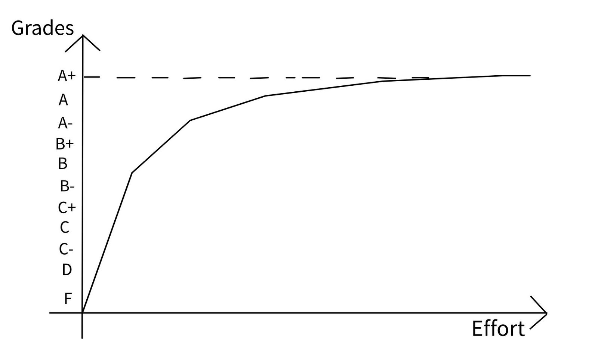
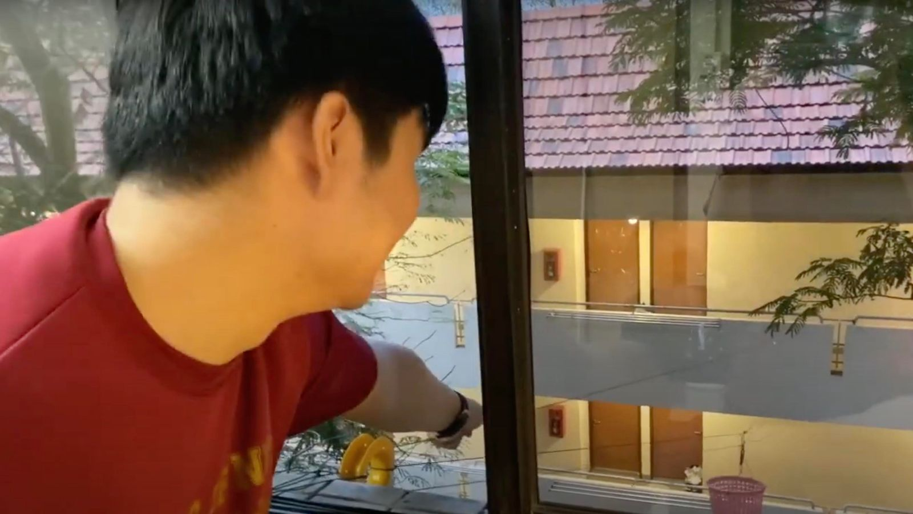
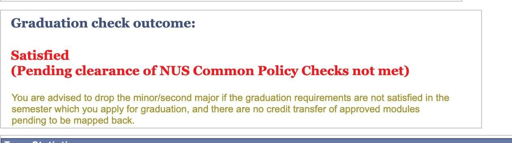
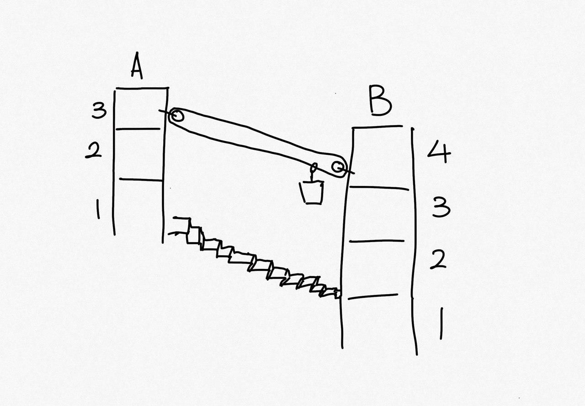
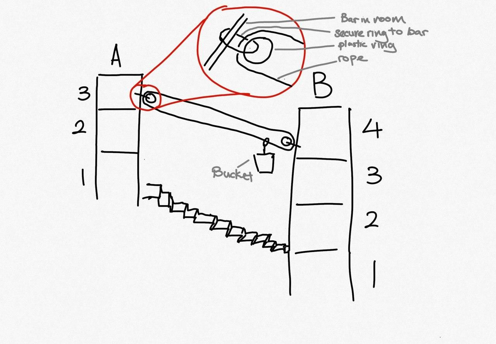
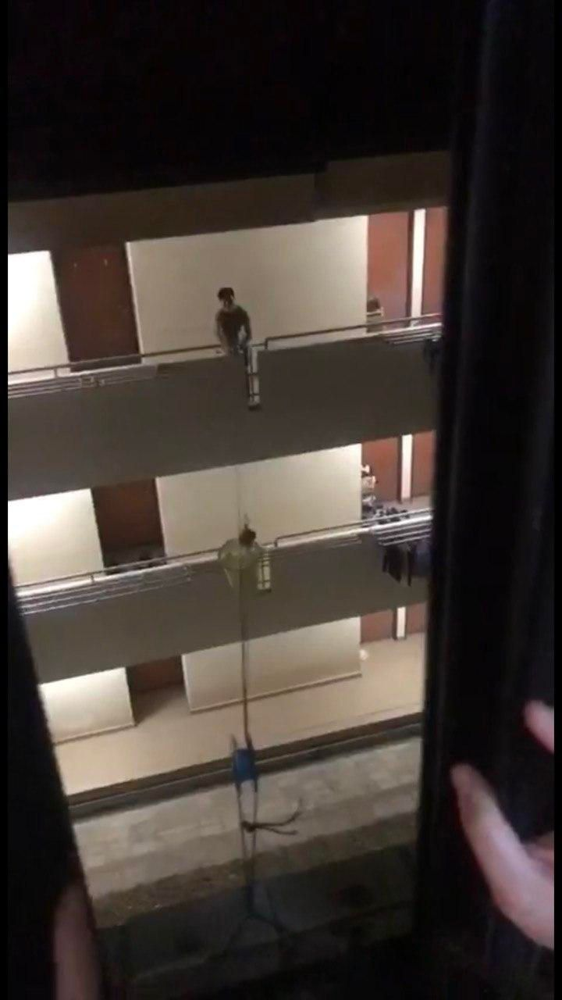
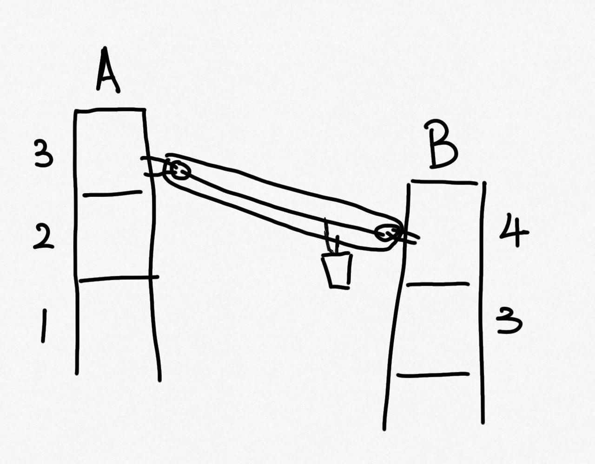
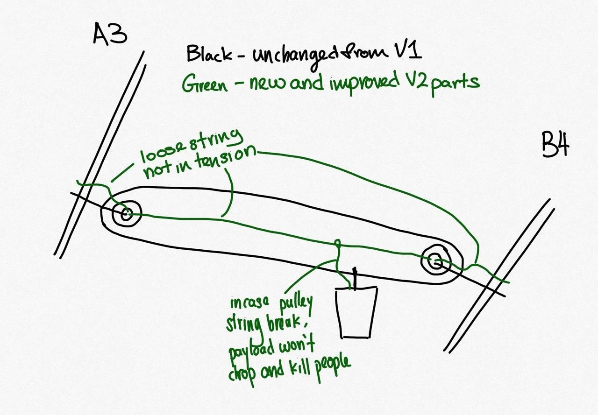
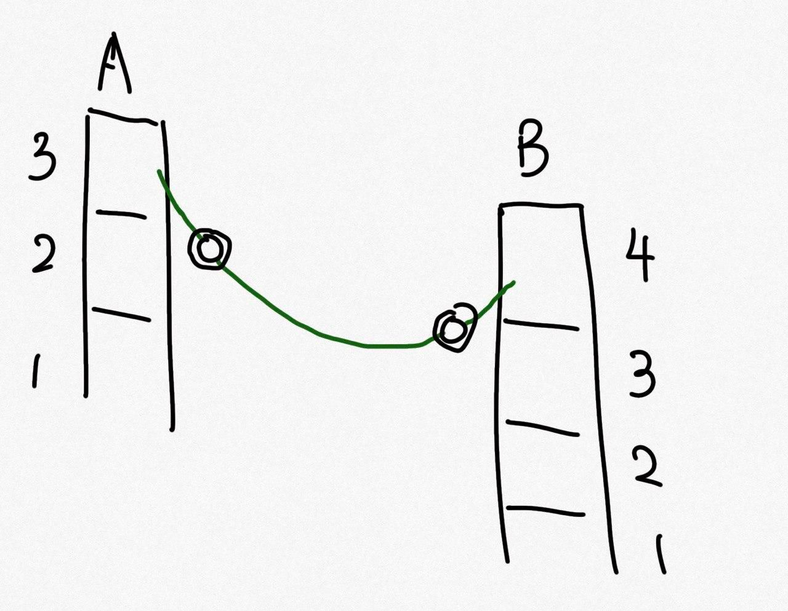

Not too long ago, I just received my last final examination results. Wasn't fantastic, but I can officially say I have graduated university.

Just to set the context, I studied at the National University of Singapore (NUS) majoring in Computer Science and Statistics. I am no super genius. Just slightly above average if not just average in terms of grades.



Year 1 Sem 1:

1. CS1101S - Programming Methodology

2. MA1101R - Linear Algebra I

3. CS1231 - Discrete Structures

4. GER1000H - Quantitative Reasoning

5. GET1026 - Effective Reasoning

Year 1 Sem 2:

1. CS2030 - Programming Methodology II

2. CS2040 - Data Structures and Algorithms

3. MA1521 - Calculus for Computing

4. IS1103 - Ethics in Computing

5. GEQ1000 - Asking Questions

6. GEH1032 - Modern Technology in Medicine and Health

Year 2 Sem 1:

1. CS2100 - Computer Organisation

2. CS2103T - Software Engineering

3. CS2101 - Effective Communication for Computing Professionals

4. CS2105 - Introduction to Computer Networks

5. CS2107 - Introduction to Information Security

6. ST1131 - Introduction to Statistics

Year 2 Sem 2:

1. CS2106 - Introduction to Operating Systems

2. ST2131 - Probability

3. GES1017 - Building a Dynamic Singapore - Role of Engineers

4. MA2104 - Multivariable Calculus

5. CS3243 - Introduction to Artificial Intelligence

Year 3 Sem 1:

Intern (NOC) Modules

Year 3 Sem 2:

1. CS3235 - Computer Security

2. ST2132 - Mathematical Statistics

3. ES2660 - Communication in the Information Age

4. ST2137 - Computer Aided Data Analysis

5. CS3244 - Machine Learning

6. CS4248 - Natural Language Processing

Year 4 Sem 1:

1. CS4243 - Computer Vision and Pattern Recognition

2. CS3203 - Software Engineering Project

3. CS4238 - Computer Security Practice

4. ST3131 - Regression Analysis

5. ST3248 - Statistical Learning I

Year 4 Sem 2:

1. CS3230 - Design and Analysis of Algorithms

2. ST4248 - Statistical Learning II

3. ST3246 - Statistical Models for Actuarial Science

4. LSM1301 - General Biology


\
Anyone that know me will tell you that I study a few weeks before finals all the time. Every start of semester I will tell them "This sem serious liao. No more joking around". And they will say "Last sem you said the same thing".

What I am going to say below may be specific to my own experience. Take it with a pinch of salt. So here is what I learned in the last 4 years.

## Everyone has their own timeline

When I was in year 1, I remember having friends/course mates who were already securing part-time internships at different companies. When discussing about a project with them, they will say things like "Oh I have work at this time. Can we meet later?". Ngl, that got me a little stressed. Though I did have a general plan [The Plan] on what I want to achieve during my university life, these people around me made me feel like my plan was wrong and I should be doing more.



Year 1 - Ease into the university life

- New way of learning. So try your best to adapt and make some friends along the way. You have the most SUs here anyway.

Year 1 summer - Participate in orientation activities

- Take this chance to be an OGL. Have some fun before you get too old.

Year 2 - Focus on school and doing projects

- Use this time to focus on school and get some good grades. Also work on projects that will help add some stuff to your resume.

Year 2 Summer - Work on some projects and find internship

- Find internship for year 3 sem 1. Simple reason is if you cannot find for year 3 sem 1, you can try again and find for year 3 sem 2.

Year 3 - Do intern and then find intern for year 3 Summer

- If I secured an internship in sem 1, it would be ideal to get an internship for summer too. The idea is to have 1 start up internship experience and 1 MNC internship experience.

Year 4 - Don't mess it up and find a job

- At this time, it is all about doing enough to graduate. Finding a job is a priority over school.


\
The plan was very simple. Have some fun at the start, find a few internships to see what kind of jobs would suit you, then get a job. I stuck with my plan. And though I do not have rows and rows of experiences on LinkedIn, I would say I am glad I did not just follow what others are doing.

Everyone wants to achieve different things in life. Even if the destination is the same, the path taken might be different. So don't waste your brain power getting stressed out about how others are doing so much more things than you while you are just sitting at home watching cat videos. It is really not worth it.

Don't have to compare yourself to others all the time. So long as you are satisfied with what you are doing, that it good enough. I always tell people 开心就好 which loosely translates to "Happy can already".

> 开心就好 - [Happy can already]

## Value experiences over grades

There is only so much studying you can do. I truly believe that even if you study 24/7, you probably won't get that A+ you want. Even if you get it, the amount of sacrifice you have to make to get it is just not worth it. Why not just take the time to make some friends and do something fun?

I stayed in hall a large part of my university life. I barely remember what grades I got for any modules. However, I remember many experiences I had with my friends. Here are some highlights:

### Building a pulley between my room and my friends

My hall was on a hill. A friend of mine stayed at the top floor of one block and I stayed on top of the other. Amazingly, there was no lift! So we came up with a plan to build a pulley across the block so we can transport food to each other. It was such an amazing idea, we did it twice.

### Take a 1 second video everyday

On my third and last year staying in hall, a group of us did not have much friends as we came in during sem 2. One of my friends suggested that we take a video every day and stitch it together at the end of the sem. Surprisingly, we actually stuck with it. Tbh, that time was also a time for us to just relax a bit and get out of the room since it was mostly online lessons (covid period).

[Link to video](https://youtu.be/R24MMWtizow)

## Be adaptable

Shit will happen along the way that you don't expect. You need to take to adapt and carry on with life. If you did badly for a test, move on and think about how you can do better next time. If you did not get the module you want, figure out and alternative. I am a strong believer in [Murphy's law](https://en.wikipedia.org/wiki/Murphy's_law).

> Murphy's Law - Anything that can go wrong will go wrong.

For me, that happened on 2 occasions. I'm sure others would have worst experiences than this. But... yea...

### Not being able to go for my overseas internship

I was accepted into the NUS Overseas College (NOC) program in school. The program gave us an opportunity to intern overseas at a start up. What made it attractive for me was that it was a chance for me to experience what it is like living and working overseas for 6 months. I was suppose to go to Israel. However, the pandemic struck and Israel closed its border to the world.

I was very disappointed. However, there was nothing we could do about it. So we were given a choice to continue the program in Singapore (meaning we find internships in Singapore) or we carry on with our university program.

Problem was, this was year 3 sem 1. If I wanted my 2 internship experiences, I would have to do an internship now. It was also way past the due date to go through the normal route of getting an internship in school. Continuing the program also means taking some entrepreneurship modules in school which I was not very keen as if I was in NUS, I would rather be taking my core modules.

However, due to circumstances, I decided to continue with the program in Singapore. Found an internship that gave me a very interesting experience and life goes on.

### Almost not being able to graduate

In my last semester, I was all set on only taking 3 modules and coasting through. Having secured a job the semester before, all I had to do was graduate. Doesn't sound difficult right? Wrong.

In the third week of the semester, while talking with my friends, one of them said something about a graduation report. It is basically a report that would tell you if you are eligible for graduation. My report marked that some policy was not met.

At this point, I was not sure what was going on. After some digging, I realised I over shot the number of module credits allowed for double counting. This means I have to take one extra module to graduate.

I was panic-ing as it was already past the period to secure modules and I may have to drop my second major to graduate in time. The problem was all the "easy" modules were already full. So I had to write emails all over the place to try and secure the module. To be fair, I did not just target getting easy modules. At that point, I would have went for any module. But I did try my best to find reasons not to take the higher level modules. hahaha

Anyway, thankfully, after a few trips to the dean's office and many emails CC-ing the world, I got a module with MCQ finals. :)

At the end of the day, I guess it all worked out. I came out in one piece and I would say I had a great 4 years.

On to the next one.

## Others

On a side topic. How did I build the pulley delivery system? I am glad you asked.

The idea was simple (in my head). Tie some rope together, tie a basket to the rope and that was it. Problem solved. Obviously, I was wrong.

### Version 1

When building the first version, we just had the goal of sending a basket from one side to the other. So here is the rough design.

As you can see, we just have to pull on the top side of the rope and the basket moves to the other side. Simple enough. The rings served as bearings for the rope to go around. Here is an in depth look at what is going on at the ring part.

The image above shows the zoomed in section of the ring. The ring will be anchored to something secure in the room. Then we will run the rope around the ring and bring it over to the other side. Here is where we faced our first problem.

Without professional equipment, how are we gonna get the rope across? Well after some intense thinking between a nurse, comms student and CS student, we came up with the idea to tie the rope to a slipper and throw it up. Took us forever to get it up.

Next problem was tying the rope. The issue was that the whole system only works if the rope was tight. If not the basket will just sag. To resolve this, we pulled the rope as tight as possible with our bare hands and tied the knot. It took rather long but the pulley was up.

[Link to first test video](https://youtu.be/9oVKaPYja-w)

All was going well and it was working fine so long as the load was not too heavy. It could transport snacks, stationary and even portable speakers. However, this design presented a few flaws:

1. If it was not clear by now, we had NO consideration for safety of the people below it. If any of the rope breaks, everything comes crashing down. Though it was a small grass hill in between, this was not a good design.

2. Over time stretching caused the ropes to loosen and the basket to sag more and more. The rope also came off the plastic rings and started rubbing against the rope that was holding the ring.

After a few months, the rope holding up the ring broke due to the friction of one rope rubbing against the other. :(

This gave us an opportunity to redesign and rebuild the whole thing!

### Version 2

In our second version, we built it with some safety systems in place. Here is the general plan.

The green parts of the drawing are things newly added from the V1 design. Those are mainly the safety lines that are there to hold the whole things up if any of the parts fail.

The idea is quite simple. Anything in tension tends to break. So for every rope in tension, we have another rope that has some slack. So if the rope in tension breaks, it is still held up and don't come falling down. So the 2 new ropes between the ring and the anchor serves that purpose.

The new rope between the 2 rings is quite interesting. During construction, we use that rope to tension the rings as tight as possible. We then put the pulley rope in place. This reduces the hassle of trying to tie the pulley as tight as possible.

[Link to building process](https://youtu.be/NxnqSgbKjbg)

To make sure everything was tight, we also went to youtube to learn how to tie a "Truckers Hitch". This gave us a way to ratchet the ropes tight without giving us rope burns.

[Link to knot used](https://youtu.be/oNsuvZOI-0U)

After everything was tight, we loosened the safety rope between the 2 rings. That rope now acts as a safety guide rope for our basket. In the event the pulley rope breaks (in tension), the basket will be held up by the safety rope (in slack). In the case everything breaks, it will just be a giant smile :)

Lastly, we also upgraded the rings from small plastic rings to giant plastic rings to reduce the chance of the ring derailing again.

With the new design, the basket was not drooping as much. Safety standards was increased as well. It also lasted longer before the hall management cut it down when we moved out. :(

Thank you for reading my Ted talk.
